# edc-pa-i4-data-ingestion

## Projeto Aplicado - Instituto de Gestão e Tecnologia da Informação.
<br>

## Ingestão de Dados de Processos Industriais.

Orientador(a): João Paulo Barbosa Nascimento

_____
<br>

### Criação do Cluster Kubernetes (k8s) em Cloud:
<br>

- Google Cloud - GCP.

    - Após instalação do `gcloud`, conforme instruções e o instalador que foi baixado verifique as informações de configuração antes de iniciar a criação do cluster:

        ```shell
        gcloud config list             
        ```

        *Output:*
        ```console
        [compute]
        region = us-east1
        zone = us-east1-c
        [core]
        account = [YOUR ACCOUNT]
        disable_usage_reporting = True
        project = [YOUR PROJECT]
        ```

    - Criação do Cluster, antes realize as verificações e configurações, estando *"ok"* pode ser executado o exemplo abaixo:
        <br>

        *Sintaxe: `https://cloud.google.com/sdk/gcloud/reference/beta/container/clusters/create`*
        <br>
        Para os testes deste projeto será utilizado o parametro `--preemptible` para alocação de instâncias do Compute Engine que duram até 24 horas e não oferecem garantias de disponibilidade, mas são mais baratas.
        <br>
        Atenção o parametro `--preemptible` não deve ser utilizado em ambientes produtivos.
        <br>
        Foram selecionadas dois tipos de maquinas `e2-standard-2` ou `e2-standard-4` para criação do cluster no período de testes, é necessário avaliar o comportamento e a estabilidade mediante ao volume de dados e capacidade de processamento mais adequada para atendimento das expectativas de disponibilização de resultados.
        <br>
        Outro ponto importante é que as configurações e recursos do GKE (Google Kubernetes Engine) sempre estão em atualização, então caso o comando abaixo retorne algum erro, utilize o processo de criação diretamente no GKE e solicite a 'linha de comando' antes de ativar o seu cluster, assim será possível verificar as alterações e corrigir o comando e manter o script o mais atualizado.
        <br>

        ```shell

        gcloud /
        beta container --project "edc-igti-smedina" /
        clusters create "cluster-pa-i4-data-k8s" --zone "us-east1-c" /
        --no-enable-basic-auth --cluster-version "1.21.5-gke.1302" /
        --release-channel "regular" --machine-type "e2-standard-2" /
        --image-type "COS_CONTAINERD" --disk-type "pd-standard" /
        --disk-size "100" --node-labels ies=igti,curso=edc /
        --metadata disable-legacy-endpoints=true /
        --scopes "https://www.googleapis.com/auth/compute",/
        "https://www.googleapis.com/auth/devstorage.full_control",/
        "https://www.googleapis.com/auth/taskqueue",/
        "https://www.googleapis.com/auth/bigquery",/
        "https://www.googleapis.com/auth/logging.write",/
        "https://www.googleapis.com/auth/monitoring",/
        "https://www.googleapis.com/auth/servicecontrol",/
        "https://www.googleapis.com/auth/service.management.readonly",/
        "https://www.googleapis.com/auth/trace.append" /
        --max-pods-per-node "110" --preemptible --num-nodes "4" /
        --logging=SYSTEM,WORKLOAD --monitoring=SYSTEM /
        --enable-ip-alias --network "projects/edc-igti-smedina/global/networks/default" /
        --subnetwork "projects/edc-igti-smedina/regions/us-east1/subnetworks/default" /
        --no-enable-intra-node-visibility --default-max-pods-per-node "110" /
        --enable-autoscaling --min-nodes "4" --max-nodes "6" /
        --no-enable-master-authorized-networks /
        --addons HorizontalPodAutoscaling,HttpLoadBalancing,GcePersistentDiskCsiDriver /
        --enable-autoupgrade --enable-autorepair /
        --max-surge-upgrade 1 /
        --max-unavailable-upgrade 0 /
        --enable-shielded-nodes /
        --node-locations "us-east1-c"

        ```
        *Script: `sh-infra\cluster_create.sh`*
        <br>

        Abaixo as telas do Console do GPC com configurações similares do comando acima para demonstrar como seria criado o cluster diretamente pela interface do GCP:
        <br>
        <p align="left">
            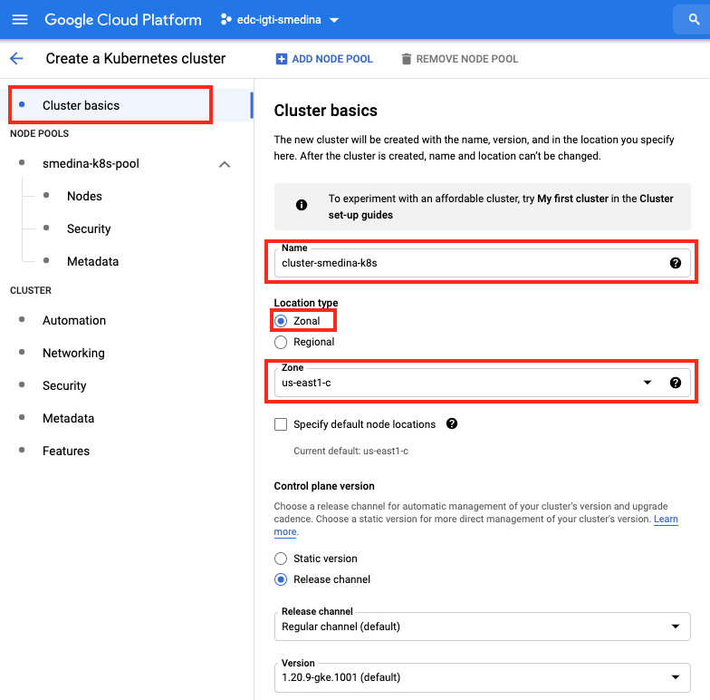
        </p>
        <br>

        <p align="left">
            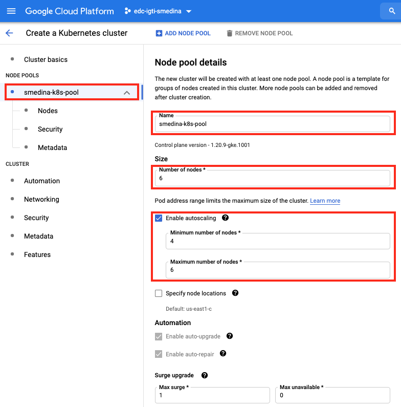
        </p>
        <br>

        <p align="left">
            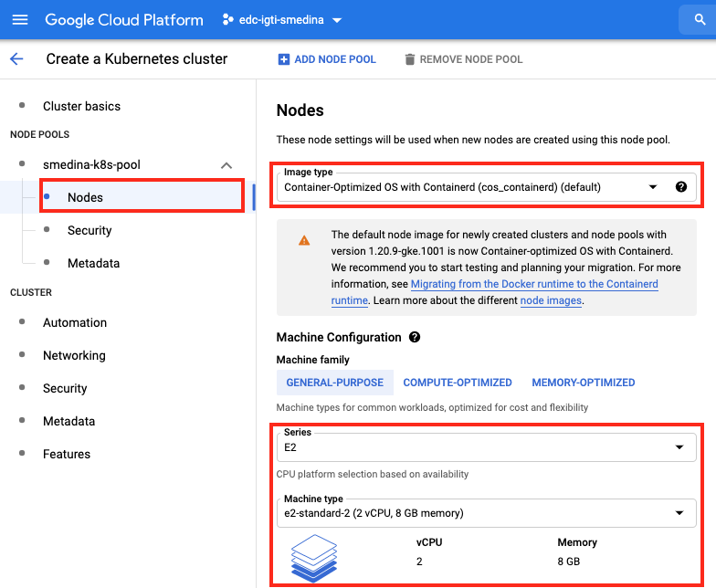
        </p>
        <br>

        <p align="left">
            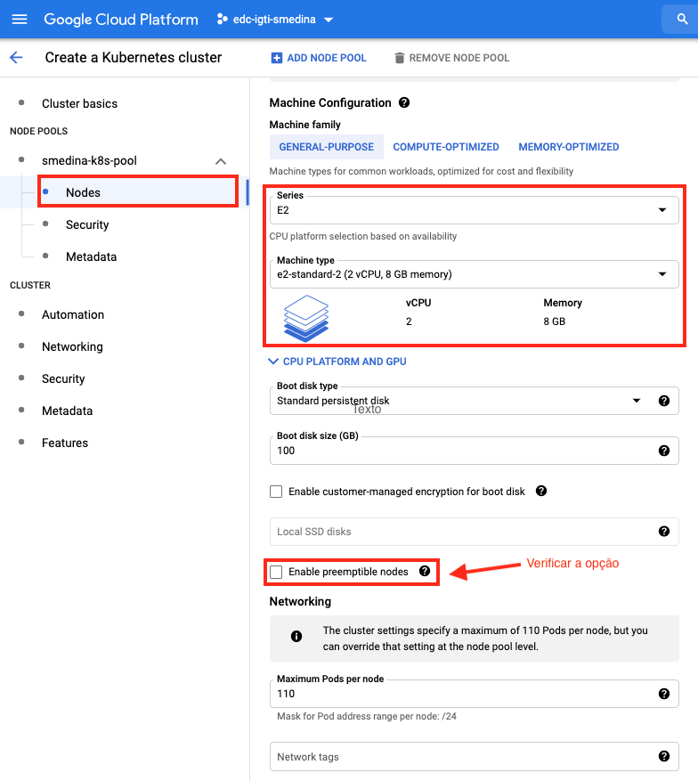
        </p>
        <br>

        <p align="left">
            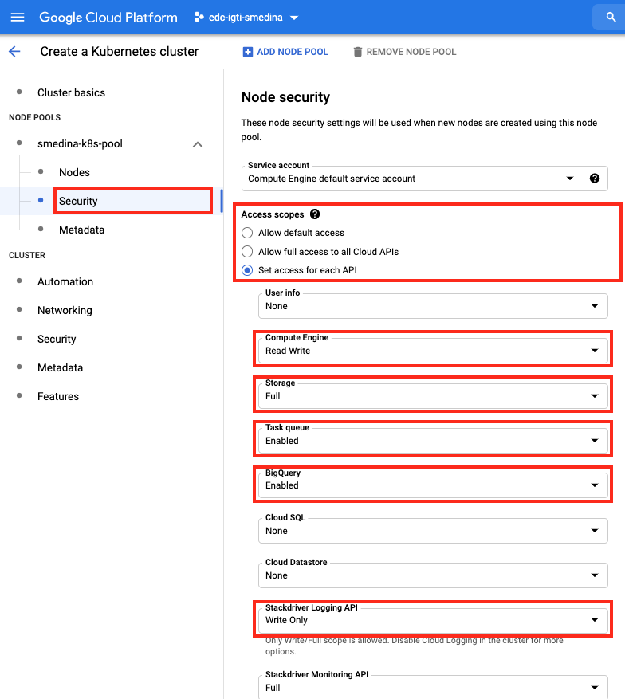
        </p>
        <br>

        <p align="left">
            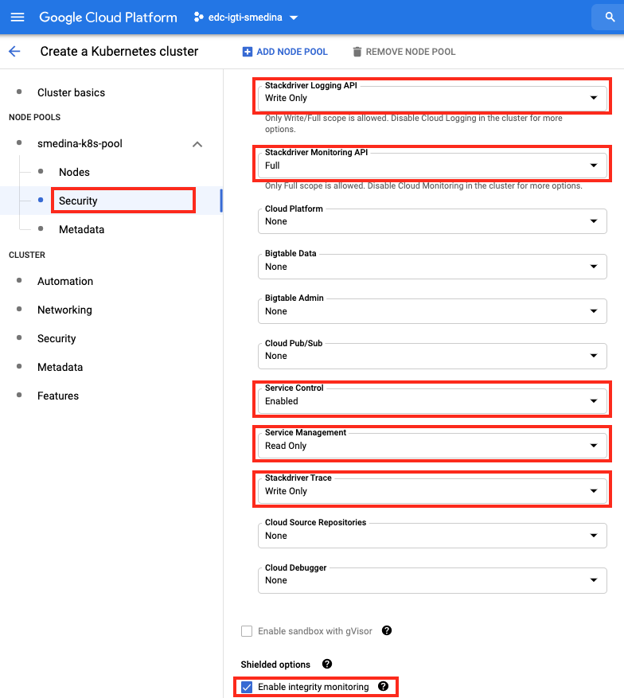
        </p>
        <br>

        <p align="left">
            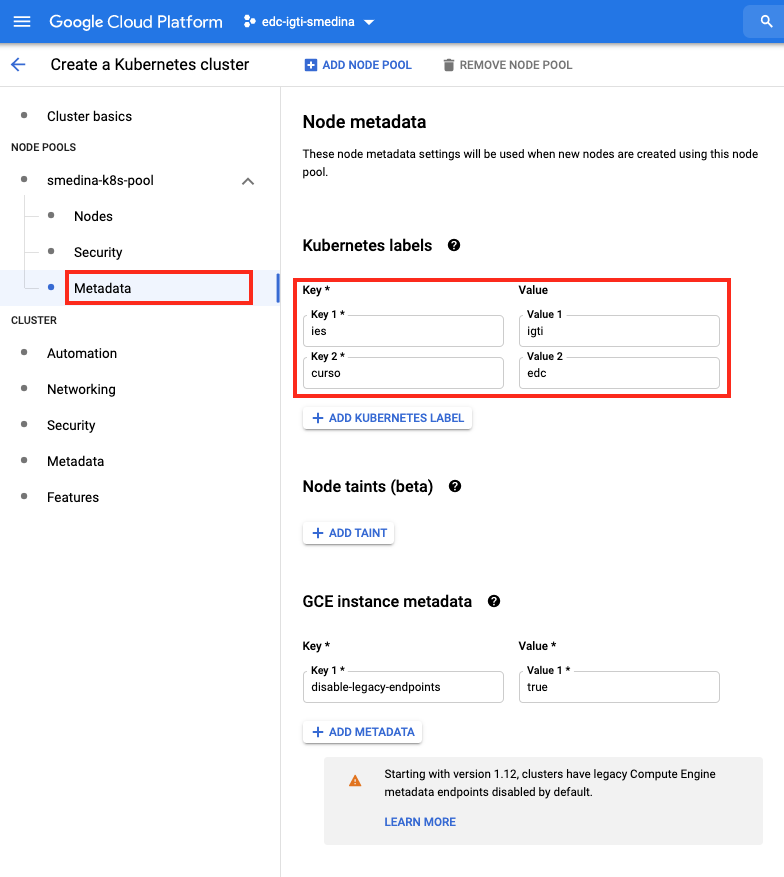
        </p>
        <br>

        <p align="left">
            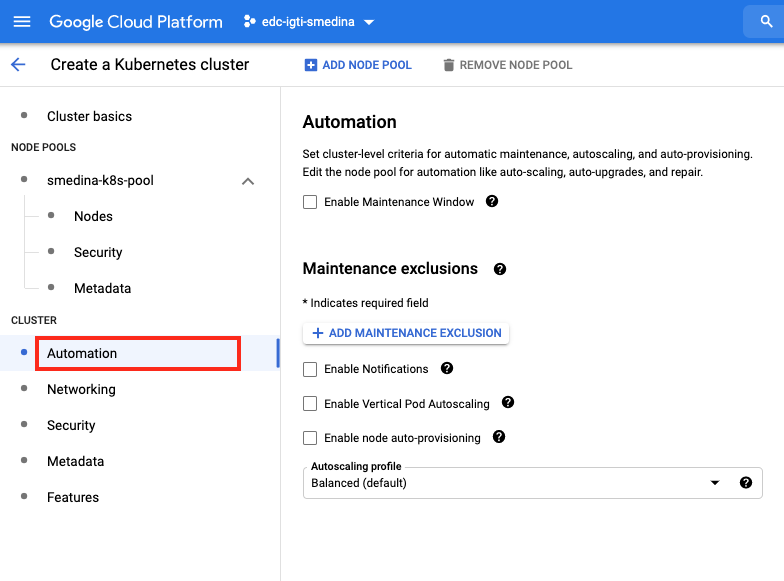
        </p>
        <br>

        <p align="left">
            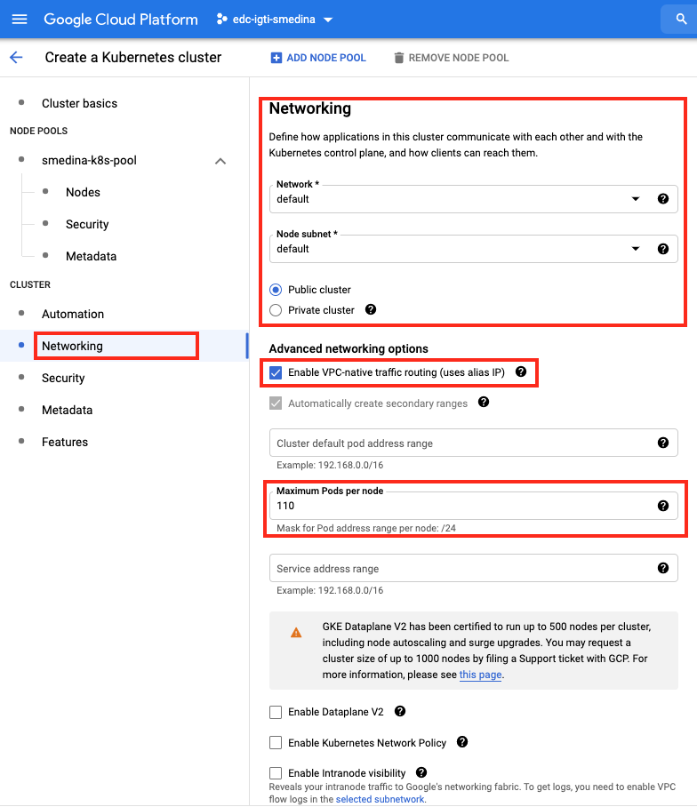
        </p>
        <br>

        <p align="left">
            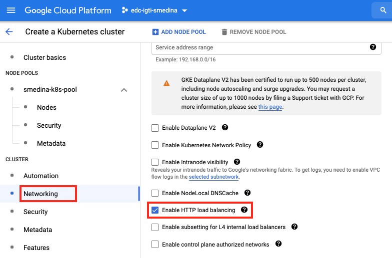
        </p>
        <br>

        <p align="left">
            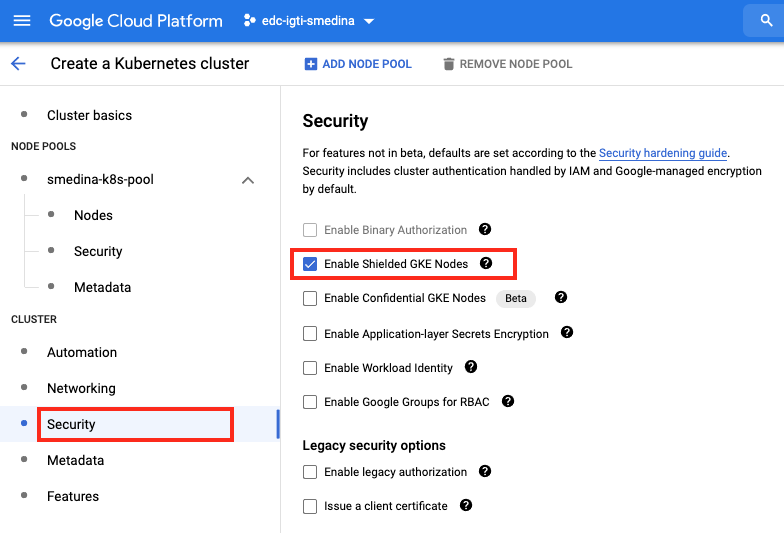
        </p>
        <br>

        <p align="left">
            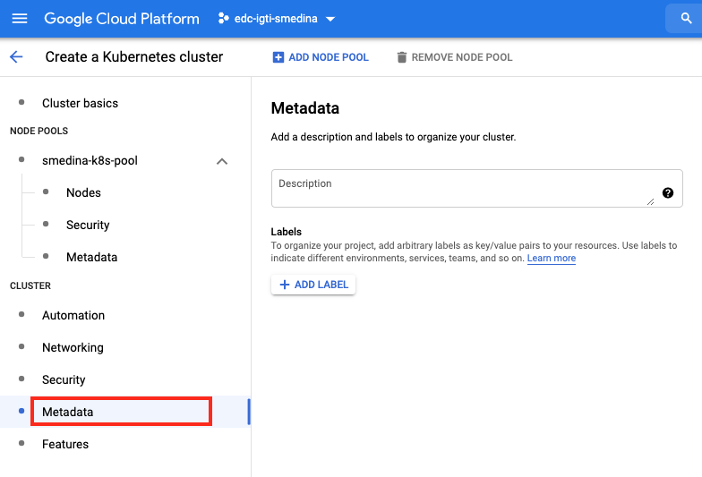
        </p>
        <br>

        <p align="left">
            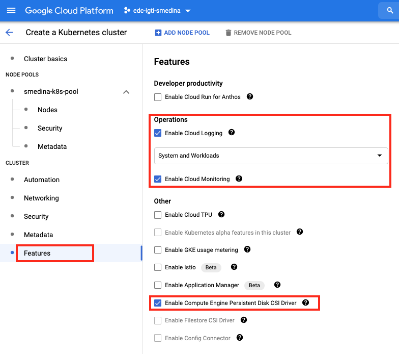
        </p>
        <br>
        <br>

    - Após a confirmação de termino e criação do cluster k8s, verifique o registro do contexto de acesso e realize uma verificação nos nodes do cluster.
    <br>
    
    Verificando o contexto de acesso.

    ```shell
    kubectx
    ```

    *Output:*
    ```console
    gke_edc-igti-smedina_us-east1-c_cluster-pa-i4-data-k8s
    ```

    <br>
    Listando nos Nodes dos Cluster.

    ```shell
    kubectl get nodes
    ```

    *Output:*
    ```console
    NAME                                                    STATUS   ROLES    AGE    VERSION
    gke-cluster-pa-i4-data-k8s-default-pool-0bde709b-0vq6   Ready    <none>   5m8s   v1.20.9-gke.1001
    gke-cluster-pa-i4-data-k8s-default-pool-0bde709b-2fb6   Ready    <none>   5m8s   v1.20.9-gke.1001
    gke-cluster-pa-i4-data-k8s-default-pool-0bde709b-dzt2   Ready    <none>   5m9s   v1.20.9-gke.1001
    gke-cluster-pa-i4-data-k8s-default-pool-0bde709b-ksgh   Ready    <none>   5m9s   v1.20.9-gke.1001
    gke-cluster-pa-i4-data-k8s-default-pool-0bde709b-vfvh   Ready    <none>   5m8s   v1.20.9-gke.1001
    gke-cluster-pa-i4-data-k8s-default-pool-0bde709b-vtvk   Ready    <none>   5m9s   v1.20.9-gke.1001
    ```

    <br>
    
    :point_right: *Atenção: se for necessário deletar o cluster utilize comando abaixo, ou busque uma referência na sintaxe para atender a necessidade.*
    <br>

    *Sintaxe: `https://cloud.google.com/sdk/gcloud/reference/container/clusters/delete`*
    <br>

    ```shell
    gcloud container clusters delete "cluster-pa-i4-data-k8s"
    ```

    *Output:*
    ```console
    gcloud container clusters delete "cluster-smedina-k8s"
    The following clusters will be deleted.
    - [cluster-pa-i4-data-k8s] in [us-east1-c]

    Do you want to continue (Y/n)?  Y

    Deleting cluster cluster-pa-i4-data-k8s...done. 
    ```
    :point_right: *Importante: Confirme a DELEÇÃO com [Enter] ou [Y].*

    <br>
    <br>